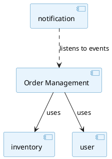
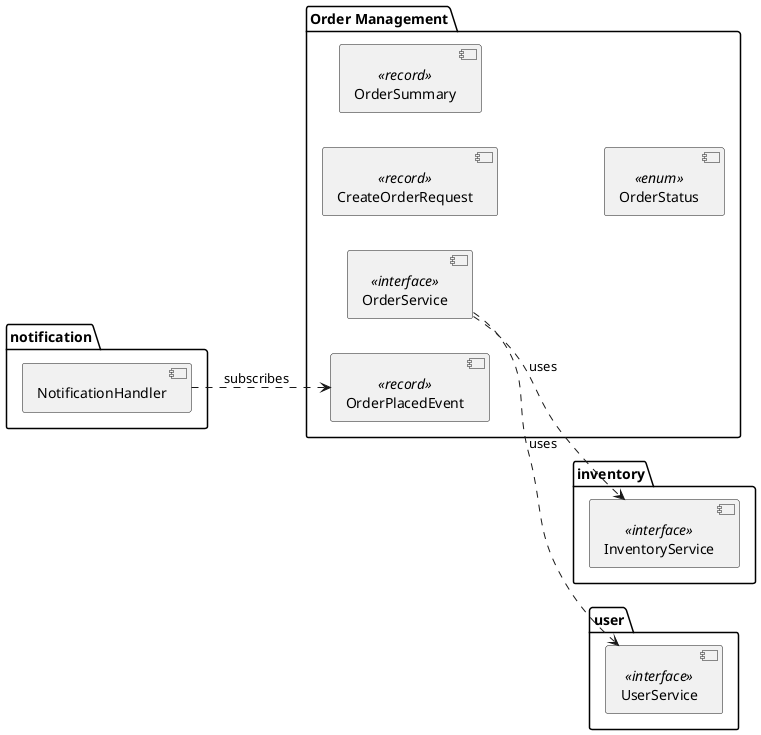

# Spring Modulith: Verifying Module Boundaries — Complete Study Guide

> **Module 3 | Brutally Detailed Reference**
> Covers `ApplicationModules.of()`, `.verify()`, exactly what gets checked (cycles, internal access, allowed dependencies), CI integration, documentation generation (PlantUML, AsciiDoc), and a head-to-head comparison with ArchUnit. Full violation output and real examples throughout.

---

## Table of Contents

1. [`ApplicationModules.of()` — Detecting All Modules](#1-applicationmodulesof--detecting-all-modules)
2. [`.verify()` — Failing on Illegal Dependencies](#2-verify--failing-on-illegal-dependencies)
3. [What Gets Verified — The Three Rules](#3-what-gets-verified--the-three-rules)
4. [Reading Violation Output](#4-reading-violation-output)
5. [Integration with Unit Tests — Verify on Every Build](#5-integration-with-unit-tests--verify-on-every-build)
6. [Generating Module Documentation](#6-generating-module-documentation)
7. [PlantUML and AsciiDoc Output](#7-plantuml-and-asciidoc-output)
8. [Spring Modulith vs ArchUnit](#8-spring-modulith-vs-archunit)
9. [Quick Reference Cheat Sheet](#9-quick-reference-cheat-sheet)

---

## 1. `ApplicationModules.of()` — Detecting All Modules

### 1.1 The Entry Point

`ApplicationModules.of()` is the starting point for all Spring Modulith verification and documentation. It scans the classpath from your `@SpringBootApplication` class and builds a complete model of the module structure:

```java
import org.springframework.modulith.core.ApplicationModules;

// The one-liner that discovers your entire module structure
ApplicationModules modules = ApplicationModules.of(MyApplication.class);
```

It doesn't start a Spring application context — it performs **static bytecode analysis** only. This makes it very fast (typically < 1 second).

### 1.2 What `ApplicationModules.of()` Does Internally

```
1. Locates the package of MyApplication.class
   → com.myapp

2. Scans all direct sub-packages (each is a module):
   → com.myapp.order       → Module "order"
   → com.myapp.inventory   → Module "inventory"
   → com.myapp.user        → Module "user"
   → com.myapp.notification → Module "notification"

3. For each module, classifies every type:
   → com.myapp.order.*          = module root = PUBLIC API
   → com.myapp.order.internal.* = sub-package  = INTERNAL
   → com.myapp.order.events.*   = sub-package  = INTERNAL (unless @NamedInterface)

4. Reads all @ApplicationModule annotations for explicit config

5. Analyzes all dependency edges:
   → Who imports what
   → Which dependencies cross module boundaries
   → Which cross-module dependencies touch internal types

6. Builds a dependency graph for cycle detection
```

### 1.3 Exploring the Module Model

```java
ApplicationModules modules = ApplicationModules.of(MyApplication.class);

// Print a summary of all detected modules
modules.forEach(module -> {
    System.out.println("Module: " + module.getName());
    System.out.println("  Base package: " + module.getBasePackage());
    System.out.println("  Dependencies: " + module.getDependencies(modules));
});

// Output:
// Module: order
//   Base package: com.myapp.order
//   Dependencies: [inventory, user]
//
// Module: inventory
//   Base package: com.myapp.inventory
//   Dependencies: []
//
// Module: user
//   Base package: com.myapp.user
//   Dependencies: []
//
// Module: notification
//   Base package: com.myapp.notification
//   Dependencies: [order (via events)]

// Get a specific module by name
ApplicationModule orderModule = modules.getModuleByName("order")
    .orElseThrow(() -> new IllegalArgumentException("No module 'order'"));

// Get module for a specific type
modules.getModuleByType(OrderService.class)
    .ifPresent(m -> System.out.println("OrderService lives in: " + m.getName()));

// Check if two modules have a dependency
boolean orderDependsOnInventory = modules
    .getModuleByName("order").get()
    .getDependencies(modules)
    .stream()
    .anyMatch(dep -> dep.getTarget().getName().equals("inventory"));

// Print all module names
modules.stream()
    .map(ApplicationModule::getName)
    .forEach(System.out::println);
```

### 1.4 `ApplicationModules` is Reusable and Cacheable

```java
// ApplicationModules is expensive to build (scans classpath) but immutable.
// Share it across tests in the same class or test suite.

class ModularityTests {

    // Built ONCE for all tests in this class — fast
    static final ApplicationModules MODULES =
        ApplicationModules.of(MyApplication.class);

    @Test void verifiesStructure() { MODULES.verify(); }

    @Test void printsDocumentation() { /* use MODULES */ }
}
```

---

## 2. `.verify()` — Failing on Illegal Dependencies

### 2.1 The Core Call

```java
ApplicationModules modules = ApplicationModules.of(MyApplication.class);

// verify() either:
//   - Returns void silently (all checks pass)
//   - Throws Violations (one or more checks fail)
modules.verify();
```

### 2.2 When to Call `verify()`

```java
// Option 1: Standalone test (most common — see Section 5)
@Test
void verifiesModuleStructure() {
    ApplicationModules.of(MyApplication.class).verify();
}

// Option 2: In @BeforeAll for a test suite
@BeforeAll
static void verifyModuleStructure() {
    ApplicationModules.of(MyApplication.class).verify();
}

// Option 3: Programmatically at application startup (unusual)
// → Not recommended: slows app startup, better to catch in CI tests
```

### 2.3 Verify with Selective Exclusions

```java
// Exclude specific packages from analysis
// (useful during incremental adoption — exclude legacy code you haven't cleaned yet)
ApplicationModules modules = ApplicationModules.of(
    MyApplication.class,
    JavaClass.Predicates.resideInAPackage("com.myapp.legacy..")
);
modules.verify();
// Everything in com.myapp.legacy.** is excluded from both detection and verification
```

---

## 3. What Gets Verified — The Three Rules

### 3.1 Rule 1 — No Cycles Between Modules

A cycle means module A depends on module B, and module B also depends on module A (directly or transitively). Cycles make modules impossible to understand or test independently.

```
Direct cycle (simplest form):
  order → inventory (order calls InventoryService)
  inventory → order (inventory calls OrderService)

  verify() output:
  Cycle detected: order → inventory → order

Transitive cycle:
  order → inventory → warehouse → order

  verify() output:
  Cycle detected: order → inventory → warehouse → order
```

**Real code example of a cycle:**

```java
// com.myapp.order — OrderService calls InventoryService
@Service
public class OrderServiceImpl implements OrderService {
    private final InventoryService inventoryService; // order → inventory
}

// com.myapp.inventory — InventoryService calls OrderService
@Service
public class InventoryServiceImpl implements InventoryService {
    private final OrderService orderService; // inventory → order → CYCLE!
}

// ApplicationModules.verify() throws:
// Violations:
//   Cycle between modules: order -> inventory -> order
```

**How to break cycles:**

```java
// Option 1: Extract shared concept to a common module
// Both order and inventory depend on "fulfillment" (no cycle)

// Option 2: Invert the dependency using events
// inventory should NOT call orderService.updateStatus()
// Instead: inventory publishes InventoryReservedEvent
// order module listens and updates order status itself

@ApplicationModuleListener
void on(InventoryReservedEvent event) {
    orderService.confirmReservation(event.orderId()); // order owns its state
}
```

### 3.2 Rule 2 — No Access to Internal Packages of Other Modules

Any type in a sub-package (e.g., `com.myapp.order.internal.*`) is **invisible** to other modules, regardless of its Java visibility modifier.

```
Illegal accesses caught by verify():

1. Direct field injection:
   com.myapp.user.UserService:
     @Autowired
     private OrderRepository orderRepo;  ← in order.internal → VIOLATION

2. Constructor parameter:
   com.myapp.notification.NotificationHandler(OrderEntity order)
   ← OrderEntity is in order.internal → VIOLATION

3. Method return type:
   com.myapp.billing.BillingService:
     public OrderEntity getOrderDetails(Long id) {...}
   ← OrderEntity is in order.internal → VIOLATION

4. Method parameter type:
   com.myapp.reporting.ReportService:
     public void generateReport(List<OrderEntity> orders) {...}
   ← OrderEntity is in order.internal → VIOLATION

5. Superclass/interface:
   com.myapp.admin.AdminController extends OrderController
   ← OrderController is in order.internal → VIOLATION

6. Annotation usage:
   com.myapp.web.WebConfig uses @OrderConfig (internal annotation) → VIOLATION
```

**Code example:**

```java
// com.myapp.order.internal.OrderEntity  ← INTERNAL
@Entity
public class OrderEntity {
    private Long id;
    private BigDecimal total;
}

// com.myapp.user.UserOrderHistory  ← ANOTHER MODULE
@Component
public class UserOrderHistory {

    // VIOLATION 1: field type is internal
    @Autowired
    private OrderRepository orderRepo;  // order.internal.OrderRepository

    // VIOLATION 2: method parameter is internal
    public void process(OrderEntity entity) { ... }  // order.internal.OrderEntity
}

// verify() throws:
// Violations:
//   Module 'user' depends on non-exposed type
//   'com.myapp.order.internal.OrderEntity' in module 'order'.
//   Illegal dependency in type: com.myapp.user.UserOrderHistory
//   Declared dependency: com.myapp.order.internal.OrderEntity
//
//   Module 'user' depends on non-exposed type
//   'com.myapp.order.internal.OrderRepository' in module 'order'.
//   Illegal dependency in type: com.myapp.user.UserOrderHistory
//   Declared dependency: com.myapp.order.internal.OrderRepository
```

### 3.3 Rule 3 — Only Allowed Dependencies Are Used

When a module declares `allowedDependencies`, verify() checks that no other modules are used:

```java
// order module declares it may ONLY depend on inventory and user
@ApplicationModule(allowedDependencies = {"inventory", "user"})
package com.myapp.order;

// If OrderServiceImpl imports NotificationService:
@Service
class OrderServiceImpl {
    private final NotificationService notificationService; // ← from notification module
}

// verify() throws:
// Violations:
//   Module 'order' is not allowed to depend on module 'notification'.
//   Illegal dependency declared in: com.myapp.order.internal.OrderServiceImpl
//   Dependency target: com.myapp.notification.NotificationService
//   Hint: Use domain events to decouple order from notification.
```

### 3.4 All Three Rules Together — A Complete Violation Report

```
Running verify() on a badly structured codebase:

org.springframework.modulith.core.Violations

The following violations were detected:

───────────────────────────────────────────────────────────────
[Rule 1 - Cycle]
Cycle detected between modules:
  order -> payment -> order

  order depends on payment:
    com.myapp.order.internal.OrderServiceImpl
      → com.myapp.payment.PaymentService

  payment depends on order:
    com.myapp.payment.internal.PaymentProcessor
      → com.myapp.order.internal.OrderRepository  (also a Rule 2 violation!)

───────────────────────────────────────────────────────────────
[Rule 2 - Internal Access]
Module 'user' depends on non-exposed type
'com.myapp.order.internal.OrderEntity' in module 'order'.
  Offending type: com.myapp.user.internal.UserDashboardService
  Field: private OrderEntity lastOrder

Module 'reporting' depends on non-exposed type
'com.myapp.inventory.internal.StockLedger' in module 'inventory'.
  Offending type: com.myapp.reporting.ReportGenerator
  Method parameter: void generate(StockLedger ledger)

───────────────────────────────────────────────────────────────
[Rule 3 - Allowed Dependencies]
Module 'order' is not allowed to depend on module 'notification'.
  allowedDependencies declared: [inventory, user]
  Illegal dependency in: com.myapp.order.internal.OrderServiceImpl
  → com.myapp.notification.EmailService

3 violation(s) detected. Fix all violations before proceeding.
───────────────────────────────────────────────────────────────
```

---

## 4. Reading Violation Output

### 4.1 Anatomy of a Violation Message

```
Module 'user' depends on non-exposed type                 ← Rule that was violated
'com.myapp.order.internal.OrderEntity'                    ← The forbidden type
in module 'order'.                                        ← Which module owns it
  Offending type: com.myapp.user.UserDashboardService     ← Where the violation lives
  Field: private OrderEntity lastOrder                    ← How it's used (field/method/etc.)
```

### 4.2 Common Fix Patterns

```
Violation: accessing order.internal.OrderEntity from user module

Fix A — Create a public DTO in the order root package:
  order.internal.OrderEntity → order.OrderSummary (public record)
  UserDashboardService now uses OrderSummary (publicly accessible)

Fix B — Remove the cross-module dependency entirely:
  Why does UserDashboardService need order data?
  Maybe UserDashboardService should subscribe to OrderPlacedEvent instead

Fix C — Move the logic into the order module:
  If UserDashboardService is really about order history,
  it belongs in the order module, not the user module

Fix D — Use @NamedInterface to expose a specific sub-package:
  If OrderEntity must be shared, expose it via a named interface
  (but usually better to create a separate DTO instead)
```

---

## 5. Integration with Unit Tests — Verify on Every Build

### 5.1 The Canonical Test Pattern

```java
// src/test/java/com/myapp/ModularityTests.java
package com.myapp;

import org.junit.jupiter.api.Test;
import org.springframework.modulith.core.ApplicationModules;

class ModularityTests {

    // Built once — immutable and thread-safe, safe to share
    ApplicationModules modules = ApplicationModules.of(MyApplication.class);

    @Test
    void verifiesModuleStructure() {
        // This test has NO external dependencies:
        // - No Spring context
        // - No database
        // - No network
        // Runs in < 1 second
        modules.verify();
    }
}
```

### 5.2 Why This Test Must Run on Every Build

```
Without the test in CI:
  Day 1: Developer adds: orderService.setNotificationService(notificationService)
          ← violates allowedDependencies but nobody notices
  Day 30: 15 more violations have accumulated
           → "let's fix them all at once" → 3-day refactoring task
           → Team morale: "the rules don't matter anyway"

With the test in CI:
  Day 1: Developer pushes the change
  Day 1: CI fails with:
         "Module 'order' is not allowed to depend on module 'notification'"
  Day 1: Developer fixes it immediately (while context is fresh)
         → 10-minute fix instead of 3-day refactoring
```

### 5.3 Adding a Module Display Test

```java
class ModularityTests {

    ApplicationModules modules = ApplicationModules.of(MyApplication.class);

    @Test
    void verifiesModuleStructure() {
        modules.verify();
    }

    @Test
    void printModuleSummary() {
        // Not a failing test — prints the module model for inspection
        // Useful during development to understand what was detected
        modules.forEach(module -> {
            System.out.println("=== " + module.getName() + " ===");
            System.out.println("  Public API types: ");
            module.getExposedInterfaces().forEach(t ->
                System.out.println("    " + t.getName()));
            System.out.println("  Depends on: ");
            module.getDependencies(modules).forEach(dep ->
                System.out.println("    " + dep.getTarget().getName()));
            System.out.println();
        });
    }
}
```

### 5.4 Incremental Adoption — Allow Violations Temporarily

When adopting Spring Modulith on an existing codebase, verify() may produce many violations that can't all be fixed at once:

```java
class ModularityTests {

    @Test
    void verifiesModuleStructure() {
        ApplicationModules modules = ApplicationModules.of(MyApplication.class);

        // Option 1: exclude legacy packages from verification entirely
        ApplicationModules cleaned = ApplicationModules.of(
            MyApplication.class,
            JavaClass.Predicates.resideInAPackage("com.myapp.legacy..")
        );
        cleaned.verify();

        // Option 2: use ArchUnit's ignore mechanism alongside Modulith
        // (see Section 8 for ArchUnit integration)

        // Option 3: document known violations and track them
        // (pragmatic: list accepted violations with TODOs)
        // → Verify the FIXED modules, skip the still-broken ones
    }
}
```

---

## 6. Generating Module Documentation

### 6.1 `Documenter` — The Documentation Generator

```java
import org.springframework.modulith.docs.Documenter;

class DocumentationTests {

    ApplicationModules modules = ApplicationModules.of(MyApplication.class);

    @Test
    void writeDocumentation() {
        Documenter documenter = new Documenter(modules);

        // Generate all documentation artifacts
        documenter
            .writeModulesAsPlantUml()               // overview diagram (all modules)
            .writeIndividualModulesAsPlantUml()     // one diagram per module
            .writeAggregatingDocument();            // AsciiDoc summary document
    }
}
```

Output location (by default):
```
target/spring-modulith-docs/
  ├── all-modules.puml          ← PlantUML: all modules and dependencies
  ├── module-order.puml         ← PlantUML: order module detail
  ├── module-inventory.puml     ← PlantUML: inventory module detail
  ├── module-user.puml          ← PlantUML: user module detail
  ├── module-notification.puml  ← PlantUML: notification module detail
  └── documentation.adoc        ← AsciiDoc aggregating document
```

### 6.2 Documenter Options

```java
Documenter documenter = new Documenter(modules,
    Documenter.Options.defaults()
        .withOutputFolder(Path.of("docs/architecture"))  // custom output path
);

// Write only the overview diagram
documenter.writeModulesAsPlantUml();

// Write with specific diagram style
documenter.writeModulesAsPlantUml(
    Documenter.DiagramOptions.defaults()
        .withStyle(Documenter.DiagramOptions.DiagramStyle.UML)  // or C4
        .withDependencyTypes(
            DependencyType.USES_COMPONENT    // show usage deps
        )
);

// Write per-module diagrams showing what each module uses and who uses it
documenter.writeIndividualModulesAsPlantUml(
    Documenter.CanvasOptions.defaults()
        .revealInternals()  // show internal packages in the diagram too
);

// Full AsciiDoc document (embeds diagrams + written descriptions)
documenter.writeAggregatingDocument(
    Documenter.DiagramOptions.defaults(),
    Documenter.CanvasOptions.defaults()
);
```

---

## 7. PlantUML and AsciiDoc Output

### 7.1 Overview PlantUML — `writeModulesAsPlantUml()`

Generated file: `all-modules.puml`



Rendered diagram:
```
┌─────────────────────┐
│  Order Management   │──────────────► ┌─────────────┐
│                     │                │  inventory  │
│                     │──────────────► └─────────────┘
│                     │
│                     │──────────────► ┌─────────────┐
└─────────────────────┘                │    user     │
          ▲                            └─────────────┘
          │ (listens to events)
┌─────────────────────┐
│   notification      │
└─────────────────────┘
```

### 7.2 Individual Module PlantUML — `writeIndividualModulesAsPlantUml()`

Generated file: `module-order.puml` — shows the order module's public API, its dependencies, and who depends on it:



### 7.3 AsciiDoc Output — `writeAggregatingDocument()`

Generated file: `documentation.adoc`:

```asciidoc
= Application Module Documentation
:toc:
:toclevels: 3

== Overview

The following diagram shows all application modules and their dependencies.

plantuml::all-modules.puml[]

== Module: Order Management

Base package: `com.myapp.order`

=== Public API

[cols="2,3", options="header"]
|===
| Type | Description
| `OrderService` | Service facade for order management operations
| `CreateOrderRequest` | Request DTO for creating a new order
| `OrderSummary` | Read-only view of order data
| `OrderPlacedEvent` | Published when an order is successfully placed
| `OrderStatus` | Enumeration of possible order states
|===

=== Dependencies

* *inventory* — checks product availability before order confirmation
* *user* — retrieves customer profile for order enrichment

=== Module Diagram

plantuml::module-order.puml[]

---

== Module: inventory

Base package: `com.myapp.inventory`

=== Public API

[cols="2,3", options="header"]
|===
| Type | Description
| `InventoryService` | Service facade for inventory operations
| `StockLevel` | Value object representing current stock for a product
|===

=== Dependencies

_(none — this is a leaf module)_

plantuml::module-inventory.puml[]
```

### 7.4 Rendering the Diagrams

```bash
# Render PlantUML diagrams to PNG/SVG
# Option 1: PlantUML CLI
java -jar plantuml.jar target/spring-modulith-docs/all-modules.puml

# Option 2: Docker
docker run --rm -v $(pwd)/target/spring-modulith-docs:/data \
  plantuml/plantuml -tsvg /data/all-modules.puml

# Option 3: IDE plugins
# IntelliJ: PlantUML Integration plugin previews .puml files inline
# VS Code: PlantUML extension

# Option 4: Include in AsciiDoc → PDF/HTML
# asciidoctor-pdf documentation.adoc
# Requires: Asciidoctor + Asciidoctor Diagram gem
```

---

## 8. Spring Modulith vs ArchUnit

### 8.1 What ArchUnit Is

ArchUnit is a Java library for writing **custom architecture rules as unit tests**. It works by loading compiled `.class` files and applying predicates:

```java
// ArchUnit example: verify layered architecture
@AnalyzeClasses(packages = "com.myapp")
class ArchitectureTests {

    @ArchTest
    static final ArchRule layeredArchitecture = layeredArchitecture()
        .consideringAllDependencies()
        .layer("Controller").definedBy("..controller..")
        .layer("Service").definedBy("..service..")
        .layer("Repository").definedBy("..repository..")
        .whereLayer("Controller").mayNotBeAccessedByAnyLayer()
        .whereLayer("Repository").mayOnlyBeAccessedByLayers("Service");
}
```

### 8.2 Conceptual Comparison

| Aspect | Spring Modulith | ArchUnit |
|---|---|---|
| **Level** | Domain module level | Any architectural rule |
| **Setup cost** | Zero (convention-driven) | High (write rules manually) |
| **Rule definition** | Implicit (package structure) | Explicit (Java DSL) |
| **Violation output** | Module-aware, contextual | Type/class-level |
| **Documentation gen** | Built-in (PlantUML, AsciiDoc) | None built-in |
| **Cycle detection** | Automatic (module level) | Manual rule required |
| **Spring awareness** | Deep (Spring beans, events) | No Spring context |
| **Flexibility** | Low (opinionated) | High (anything you can express) |
| **Learning curve** | Minimal | Moderate |
| **Custom rules** | Limited | Unlimited |

### 8.3 What Modulith Does That ArchUnit Can't (Easily)

```java
// 1. Module-aware documentation generation
new Documenter(modules).writeModulesAsPlantUml();
// ArchUnit: no equivalent

// 2. Named interface support
// Modulith: @NamedInterface exposes specific sub-packages
// ArchUnit: need custom predicates

// 3. Spring event dependency analysis
// Modulith: detects "notification depends on order via events"
// ArchUnit: only sees bytecode imports, misses event-driven wiring

// 4. allowedDependencies as first-class concept
// Modulith: @ApplicationModule(allowedDependencies = {"inventory"})
// ArchUnit: requires verbose rule definition

// 5. @ApplicationModuleTest isolation
// Modulith: loads only one module's Spring beans for testing
// ArchUnit: no equivalent (ArchUnit doesn't start Spring)

// 6. Module detection from package structure
// Modulith: zero configuration
// ArchUnit: must manually define "what is a module"
```

### 8.4 What ArchUnit Does That Modulith Can't

```java
// 1. Custom layer rules (Modulith doesn't know about layers within a module)
@ArchTest
static final ArchRule controllers_should_not_access_repositories =
    noClasses().that().resideInAPackage("..controller..")
        .should().accessClassesThat().resideInAPackage("..repository..");
// Modulith: no equivalent — it only cares about cross-module access

// 2. Naming conventions
@ArchTest
static final ArchRule services_should_be_named_correctly =
    classes().that().resideInAPackage("..service..")
        .should().haveSimpleNameEndingWith("Service");
// Modulith: doesn't enforce naming

// 3. Annotation rules
@ArchTest
static final ArchRule controllers_should_have_rest_controller =
    classes().that().resideInAPackage("..controller..")
        .should().beAnnotatedWith(RestController.class);

// 4. Access modifier rules
@ArchTest
static final ArchRule services_should_not_be_public_unless_interface =
    classes().that().implement(nameMatching(".*Service"))
        .should().notBePublic();

// 5. Cyclic dependency detection at class level (not just module level)
@ArchTest
static final ArchRule no_cycles = slices()
    .matching("com.myapp.(*)..")
    .should().beFreeOfCycles();
// More granular than Modulith (class-level vs module-level)
```

### 8.5 Using Both Together (Recommended)

```java
// They complement each other perfectly:
// Spring Modulith: module-level boundaries + documentation
// ArchUnit: intra-module rules + naming conventions

// ModularityTests.java — Spring Modulith
class ModularityTests {
    @Test
    void verifiesModuleStructure() {
        ApplicationModules.of(MyApplication.class).verify();
    }
}

// ArchitectureTests.java — ArchUnit
@AnalyzeClasses(packages = "com.myapp")
class ArchitectureTests {

    // Rule 1: naming conventions (Modulith doesn't do this)
    @ArchTest
    static ArchRule serviceNaming = classes()
        .that().areAnnotatedWith(Service.class)
        .should().haveSimpleNameEndingWith("Service")
        .orShould().haveSimpleNameEndingWith("ServiceImpl");

    // Rule 2: no @Transactional on controllers (Modulith doesn't do this)
    @ArchTest
    static ArchRule noTransactionalOnControllers = noClasses()
        .that().areAnnotatedWith(RestController.class)
        .should().beAnnotatedWith(Transactional.class);

    // Rule 3: repositories only accessed from service layer (intra-module)
    @ArchTest
    static ArchRule repositoryAccess = noClasses()
        .that().haveSimpleNameEndingWith("Controller")
        .should().dependOnClassesThat()
        .haveSimpleNameEndingWith("Repository");

    // Rule 4: no field injection (prefer constructor injection)
    @ArchTest
    static ArchRule noFieldInjection = noFields()
        .should().beAnnotatedWith(Autowired.class)
        .because("Use constructor injection instead");
}

// Together they cover:
// Modulith: inter-module access, cycles, allowedDependencies
// ArchUnit: intra-module structure, naming, annotations, patterns
```

### 8.6 Summary — When to Use Which

```
Use Spring Modulith when:
  ✓ You want domain module boundaries with zero configuration
  ✓ You want auto-generated architecture documentation
  ✓ Your architecture IS a modular monolith
  ✓ You want @ApplicationModuleTest for isolated module testing
  ✓ You want event-driven dependency tracking

Use ArchUnit when:
  ✓ You need custom rules that Modulith doesn't support
  ✓ You need intra-module rules (layers within a module)
  ✓ You need naming conventions enforced by tests
  ✓ You need micro-level architectural rules

Use both:
  ✓ Spring Modulith for the big picture (inter-module)
  ✓ ArchUnit for the details (intra-module)
  ✓ They don't conflict — they complement
```

---

## 9. Quick Reference Cheat Sheet

### Core API

```java
// Discover modules
ApplicationModules modules = ApplicationModules.of(MyApplication.class);

// Verify all rules (throws Violations on failure)
modules.verify();

// Explore the model
modules.forEach(m -> System.out.println(m.getName()));
modules.getModuleByName("order");
modules.getModuleByType(OrderService.class);

// Generate documentation
Documenter doc = new Documenter(modules);
doc.writeModulesAsPlantUml();              // overview diagram
doc.writeIndividualModulesAsPlantUml();    // per-module diagrams
doc.writeAggregatingDocument();            // AsciiDoc doc

// Default output: target/spring-modulith-docs/
```

### The Three Rules Verified

```
Rule 1 — No cycles:
  order → inventory → order  ← VIOLATION

Rule 2 — No internal access:
  user.UserService → order.internal.OrderEntity  ← VIOLATION

Rule 3 — Respect allowedDependencies:
  @ApplicationModule(allowedDependencies = {"inventory"})
  order.OrderService → notification.EmailService  ← VIOLATION
```

### Canonical Test

```java
class ModularityTests {
    ApplicationModules modules = ApplicationModules.of(MyApplication.class);

    @Test
    void verifiesModuleStructure() {
        modules.verify();
    }
}
// No Spring context, no DB, runs in < 1 second
// Add to CI — run on every commit
```

### Modulith vs ArchUnit

```
Spring Modulith:  module-level, convention-driven, docs generation, zero setup
ArchUnit:         any rule, fully custom, naming/annotation/access, needs DSL

Use together:
  Modulith → inter-module boundaries + documentation
  ArchUnit  → intra-module structure + naming + annotations
```

### Key Rules to Remember

1. **`ApplicationModules.of()` is static analysis** — no Spring context started, no DB needed, very fast.
2. **`verify()` throws `Violations`** — it's a runtime exception; JUnit catches it and fails the test with the full message.
3. **Three checks run automatically** — cycles, internal access, and `allowedDependencies` violations are all checked in one call.
4. **Run `verify()` in CI on every commit** — violations are 10-minute fixes when caught immediately, multi-day refactors when accumulated.
5. **Reuse `ApplicationModules` instance** — building it is cheap but not free; declare it as a field to share across tests.
6. **Documentation output is `target/spring-modulith-docs/`** — commit the generated `.puml` files if you want architects to review them in PRs.
7. **PlantUML rendering is separate** — Spring Modulith generates `.puml` text; you need PlantUML CLI or IDE plugin to render to PNG/SVG.
8. **Modulith doesn't enforce intra-module rules** — use ArchUnit for naming conventions, annotation rules, and layer boundaries within a module.
9. **Incremental adoption** — use `JavaClass.Predicates.resideInAPackage("com.myapp.legacy..")` to exclude messy legacy code while you clean it up.
10. **`verify()` catches the wrong direction** — `allowedDependencies` is directional; verify() catches "A depends on B" violations but also catches cycles where B depends back on A.

---

*End of Verifying Module Boundaries Study Guide — Module 3*
